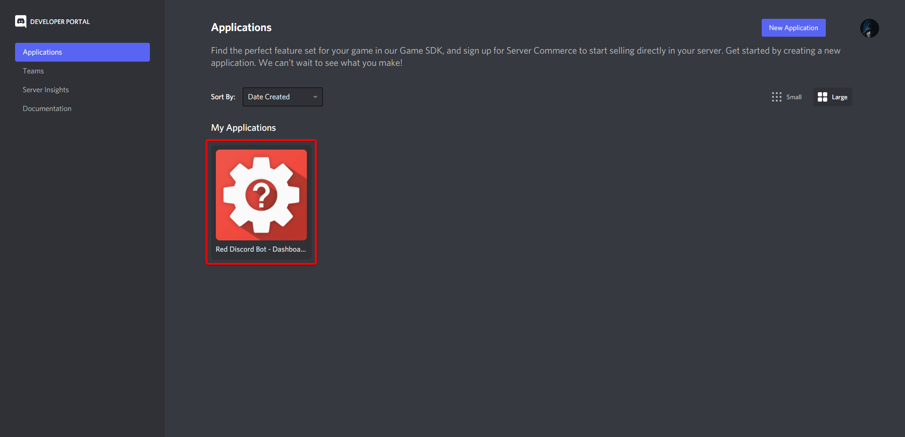
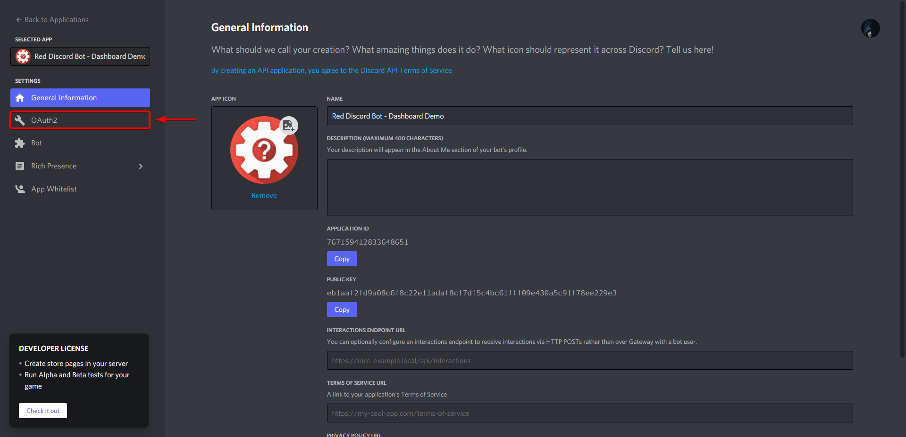
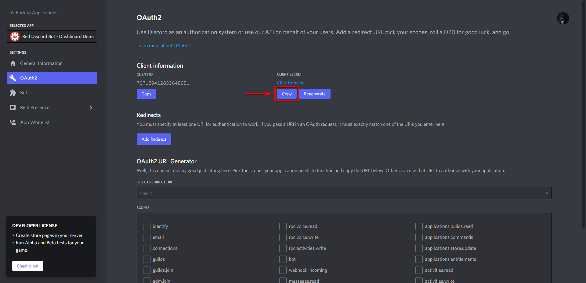
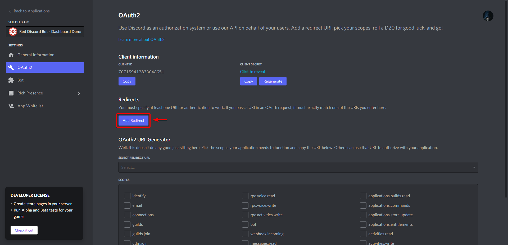
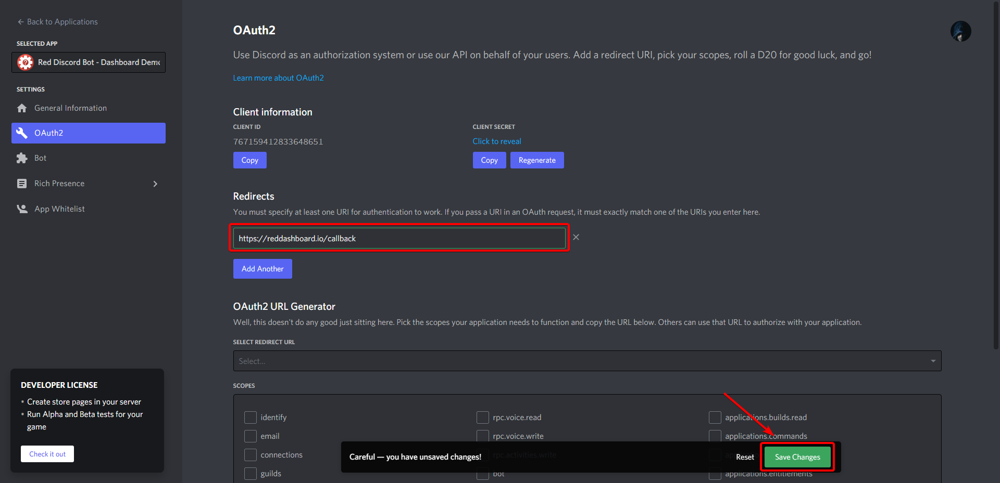

Configuration Companion Cog - Single Bot
========================================

Welcome to the Dashboard Cog Configuration Guide. While running the
below directions, it is assumed that you have installed the dashboard
cog from the Toxic Cogs repository, and have loaded it, according to the
`Installing Companion Cog <installing_companion_cog>` guide.

Set the client secret
---------------------

The client secret is used so that the bot can obtain a user's profile
when logging in, and restricts what the user can do on the dashboard
according to their assigned permissions. The client secret is never used
maliciously, nor is user's data.

First, login to the Discord Developer Console (found `here <https://discord.com/developers/applications>`__) and click on your bot's application.

Next, navigate to the tab that says "OAuth2"

Copy the secret to your clipboard by clicking the Copy button, then take the secret and paste it into the following command, replacing ``<secret>`` with your clipboard value.

.. tip::

    ``[p]`` represents your bot's prefix.  Make sure to replace it when pasting these commands inside of Discord.

.. code-block:: none

    [p]dashboard webserver secret <secret>

.. danger::

   Never, ever paste your client secret anywhere other than in the command listed above.  Enter the above command in DMs to ensure that no one copies your token.

Set the redirect URL
--------------------

The redirect URL is where the user will be redirected after authorizing
the bot access to their profile. In order for the bot to process the
data correctly, the URL must be at the ``/callback`` endpoint of the
server.

Determine your redirect
~~~~~~~~~~~~~~~~~~~~~~~

There are two options for the redirect URL, however one of them is only
available under certain circumstances.

Option #1: Domain (Recommended)
^^^^^^^^^^^^^^^^^^^^^^^^^^^^^^^

.. attention:: 

   This option is only available of the following is true:

   1. You have a domain bought and set up, and are ready to connect it to
      the dashboard.
   2. You acknowledge that direct support will not be given for connecting
      the dashboard to the domain.

When running on a domain, the redirect should be something like
``https://domain.com/callback``. For example, if my domain was
``reddashboard.io``, my redirect would be
``https://reddashboard.io/callback``. Save this redirect to your
clipboard.

.. danger:: 

   It is highly recommended to use a reverse proxy when setting up the dashboard. Check out `Reverse proxying with Apache <../reverse_proxy_apache>` or `Reverse proxying with Nginx <../reverse_proxy_nginx>` to get started, if you are on Linux.

Option #2: Local/Private IP address
^^^^^^^^^^^^^^^^^^^^^^^^^^^^^^^^^^^

.. attention::

   This option is only available if the following is true:

   1. You only want the webserver accessible to you.
   2. You are running the webserver on a the same network as the computer
      you will access the dashboard from.

There are two options for the redirect URL in this situation, depending
on how you will be accessing the dashboard. Follow the step below
depending on which one you prefer:

If you wish to access the dashboard on the same device that the webserver is running on, your redirect URL will be similar to ``http://127.0.0.1:42356/callback``.

If you wish to access the dashboard on a device that is connected to the same network, your redirect URL will be similar to ``http://ipaddress:42356/callback``, replacing ``ipaddress`` with your device's private IP.

.. tip::

   You can find your private IP address by running ``ipconfig`` on Windows, or ``ifconfig`` on Mac/Linux.

Registering the redirect
~~~~~~~~~~~~~~~~~~~~~~~~

Copy the redirect URL as determined in the previous step to your clipboard, then paste into the command below, replacing ``<redirect>`` with the redirect:

.. code-block:: none

   [p]dashboard webserver redirect <redirect>

Switch back to the page for your application on the Discord Developer Console, then under the redirects, click "Add Redirect"

Then paste your redirect into the new field, and click "Save Changes"

.. tip::

   Discord should highlight the box in green if your redirect is a well-formatted URL.  If it isn't, make sure you include ``http`` and your domain/IP address properly.

.. important::

   The redirect set in the dashboard cog and the developer portal must be exactly the same, or Discord will prevent authorization.

Register support server (Optional)
----------------------------------

You may want to have a link to your support server in case anybody needs
help with the dashboard. To do this, grab an invite link for your
server, and paste it into the command below, replacing ``<invite>`` with
the link to your server:

.. code-block:: none

    [p]dashboard settings support <invite>

*You can now proceed to `Running the Webserver with Single bots <../launching_guides/running_webserver_one_bot>` *to finish up the process.*