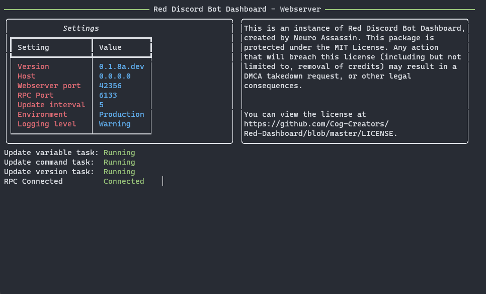

Running the Webserver with multiple bots
========================================

.. important::

    In order for the bot to communicate with the webserver, you must add the argument ``--rpc`` to the start line of each of your Red bots.  Additionally,
    you must add ``--rpc-port <rpcport>`` to the start line for each of your bots, dependent on the webserver you are connecting to.

At this point, the dashboard cog should be loaded and initialized on your Red bot, and restarted to have RPC enabled (as mentioned above).
The webserver package should be installed into it's own, separate virtual environment, and your OAuth2 settings should be updated within Discord.

Once you are squared away, activate your virtual environment using the command during installation, then for each of your webservers, run the following command,
replacing ``<webport>`` and ``<rpcport>`` with the ports you came up with `here <../configuration_guides/multibot>`:

.. prompt:: bash

   reddash --port <webport> --rpc-port <rpcport>

A text interface should pop up, similar to that below (note that your ports will be different):

If your screen looks like the above, congrats!  Your dashboard should be successfully connected to your Red bot, and viewable at the domain/IP address
specified in `Configuration Companion Cog - Multi Bot <../configuration_guides/multibot>`.  If you wish for the webserver to run with Automatic Startup, check out
the `Automatic Startup (systemctl) <../installation_guides/systemctl_startup>` guide if you are on Linux.

Does your bot say RPC Disconnected or some other error?  Check to make sure that your bot started with the ``--rpc`` flag and are using the same RPC ports.  If
you have any other issues, feel free to drop by the support server listed `here <../help_and_support>`.